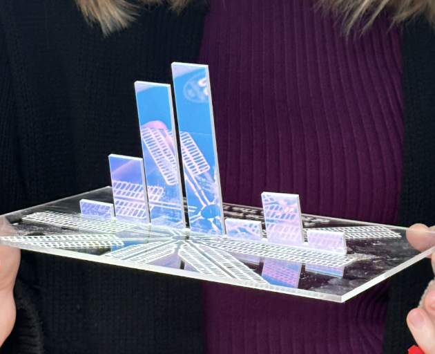

# About 📚

### Prior Expectations

My motivation to take this class stemmed from a desire to do something “different” while remaining in my English major curriculum. Given my lack of coding experience and intimidation toward the subject, this course’s claim that students needed no prior experience piqued my interest. My tech knowledge practically consisted of creating a Weebly website for an 8th-grade history project—an assignment I remember enjoying, especially in curating the layout and design to display my research to the public. I thus enrolled in ENGL 1650 with no idea what to expect, eager to test the waters and broaden the scope of my major’s requirements. When friends inquired about my schedule and what this class would entail, I often gave a blurb about learning basic coding for humanities projects, not knowing what that even meant to me. To my surprise, digital humanities has proven to be broader and more flexible than I expected, drawing on creativity and artistry to represent the humanity of data.

### The First Few Weeks

The humanity behind data has proven to be the recurring theme in this course’s content. From the very beginning of the class, we engaged with readings and lectures like Giorgia Lupi’s [“Finding Humanity in Data”](https://www.youtube.com/watch?v=IYRhCZ0vvFQ) discussion, which provided a solid foundation for our emphasis on humans as the driving force behind modern technology. Lupi’s account of a site-specific visualization of an exhibition at the Museum of Modern Art especially piqued my interest. This project provided insight into art’s role as a model of humanistic data in personal and interactive formats. I began to note connections between humanistic research and art and to discover the capacity of artwork to communicate powerful, data-driven messages to the public. 

Our discussions also often centered around ethical challenges in dealing with data that represents real people. These issues appear especially in the [Digital Panopticon project](https://www.digitalpanopticon.org/The_Ethics_of_Digital_Data_on_Convict_Lives), a project that reproduces nineteenth-century criminal records. As the project recreates the records, it reinforces nineteenth-century stereotypes while reducing convicts to their criminal records. The project site details its various ethical debates, all of which have no “easy answers.” Discussions of complex research projects like this have helped me understand the nuance of humanistic data, of which there are no black-and-white “correct” answers but ethical debates. 

### Visit to Eastern State Penitentiary

Following weeks of discussion and reading on the ethics, challenges, and functions of digital humanities, we had the opportunity to visit [Eastern State Penitentiary](https://www.easternstate.org/) prior to conducting research for the [Printing in Prisons](https://printinginprisons.org) Project. This field trip set the stage for our multimedia essays by giving me a firsthand account of the visceral experience of existing within the prison. Touring the prison on my own with audio tour headphones helped to encapsulate me in the solitude of the prison’s history and to empathize with the people who spent so much of their lives incarcerated in the space. Seeing the crumbling walls and noting the smell of mildew in the air was an inescapable reminder of the rich history of the prison and the generations of real people who had lived within its confinement. Immersing myself in this environment heavily informed my research, provided jumping-off points for topic ideas, and helped me to recognize and understand the realness of the history we were dealing with. 

### Creating a Multimedia Essay

Given my love for art, I knew I wanted to investigate art-making in prison in some capacity as part of my multimedia essay. The colorful graphics of the Eastern Echo printed at Eastern State especially stood out to me—most notably, the vibrant blue cover illustration of the Summer 1965 edition of the publication. With the convenience of our dataset, I could locate the image in the spreadsheet, along with the subsequent credits page, which noted the staff illustrator of the edition: “S.R. Cantoral.” 

Searching through the Printing in Prisons dataset, I located every space where Cantoral’s name appeared, and I discovered that he was an involved individual within the prison community. An avid baseball player, dental employee, artist, and writer, Socrates Cantoral seemed to engage with nearly every program the penitentiary had to offer. When I discovered an article titled “A Profile of Socrates Cantoral,” I knew I’d hit a jackpot. This feature article provided insight into Cantoral’s engagements in the prison and his life before Eastern State. It provided powerful quotes that spoke to his own desire to reclaim himself after his past mistakes. 

<img src="assets/images/

Honing in on Socrates Cantoral’s life was an opportunity to highlight a body of beautifully crafted artwork—creations that would not have existed had he not been incarcerated. By neglecting to mention his criminal record, I intentionally spotlighted Cantoral’s creations and commitment to many extracurricular activities at the penitentiary and his good reputation among other prisoners. Dealing with this data required significant care and attention to ethical concerns raised at the beginning of the course. I referred back to my time spent at the prison to help embody Cantoral’s headspace to the best of my ability.

The assignments to attend workshops at Penn and in the greater Philadelphia area were enjoyable and insightful opportunities to venture beyond my comfort zone and attend something solo while using my hands to engage with technology. My Philly workshop was especially noteworthy—I participated in a screen-printing class at the [West Philly Tool library](https://westphillytools.org/) on a Thursday evening. While I had screen-printed three years prior in a pre-college summer art course, this experience was much different in that we relied on low-budget and improvised tools throughout the process—such as a tupperware bucket, a cheap UV lamp, and a single heat lamp. With few supplies and a small, intimate group of creative-minded individuals, we each took turns and aided each other throughout the process. My time at the Tool Library was highly collaborative and reinforced the concept of people being “printers” before the advent of the modern mechanized printer. 

### Critical Making Collaboration

I was surprised to find that digital humanities is much broader and more flexible than I expected—this was something especially salient in the midst of our [Critical Making Project](https://docs.google.com/presentation/d/1ugMWW4K39iqshgfNomaZctrOOLxqo7CDgSkNeYDUQSo/edit?usp=sharing), where we had the chance to create a meaningful object as a representation of data from Eastern State. The project was broad and full of possibilities—it felt like an assignment from a fine arts class, but one with a foundation in concrete research. The process of working together to create a laser-cut word count histogram with my group was a lesson in itself—as we built off of each other’s ideas and improvised throughout the actual design process, we watched as our collective thinking morphed into an object charged with meaning.

### Conclusion

My time spent in this Introduction to Digital Humanities course has introduced me to a subject matter I was never aware of—a subject that surprisingly draws on my creative and literary passions. Through hands-on projects and a collaborative class atmosphere, this class overwhelmingly reinforced the humanity of the people represented in data, redefining my relationship and understanding of research and case studies from the past, especially in the context of carceral studies.
